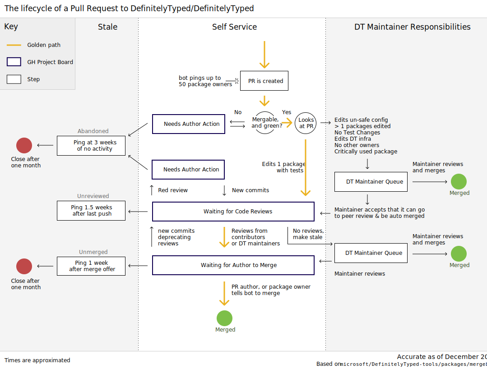

_Disclaimer: This could be out of date, the source of truth is always [compute-pr-actions]_

<!-- https://www.figma.com/file/jIYpibfnaKRhq9rpK5wwkj/dt-pr-lifecycle-Eli -->

### What PRs does the bot ignore

- Draft PRs
- Closed PRs

### What type of PRs need to be reviewed by a DT maintainer

- PRs that affect DT infrastructure
- PRs that affect more than 50 Definition Owners
- PRs that affect extremely popular packages (5m downloads per month)
- PRs that add new packages
- PRs that change DT types with no tests
- PRs that change DT types and there are no other Definition Owners
- PRs that change a DT module's infra (`tsconfig.json` etc)

PRs that are blessed (see `info.blessingKind`) as `review` are excluded
when possible, and PRs that are blessed as `merge` can be merged without
reviews.

### Stale PRs

There are several categories for PRs getting stale: "Unmerged" (good to go, but
author+owners didn't request to merge them), "Abandoned" (bad CI, change
requests), "Unreviewed" (got no reviews).  Each of these starts a day countdown
at a configurable point, and goes through several states at configurable day
counts:

- `fresh`: just entered the corresponding staleness timeline, nothing done.
- `attention`: the inactivity is now shown on the welcome message with a brief
  explanation.
- `nearly`: a comment is posted and a label with the staleness category is
  added.
- `done`: the timeline is done, either move the PR to a column (unreviewed) or
  close it (the other).

See the `getStaleness` definition in [compute-pr-actions] for the current
configuration (conditions, count start, day counts, and final action).

The explanations for `attention` and the posted comments are defined in
`StalenessExplanations` and `StalenessComment` respectively (in [comments]).

### Cleanup

The [`run` script](../src/run.ts) is running every 6 hours, cutting the
`Recently Merged` column to 50.  It also removes closed PRs from other columns
as a safeguard in case the bot missed a PR closing event.

[compute-pr-actions]: <https://github.com/microsoft/DefinitelyTyped-tools/blob/main/packages/mergebot/src/compute-pr-actions.ts>
[comments]: <https://github.com/microsoft/DefinitelyTyped-tools/blob/main/packages/mergebot/src/comments.ts>
